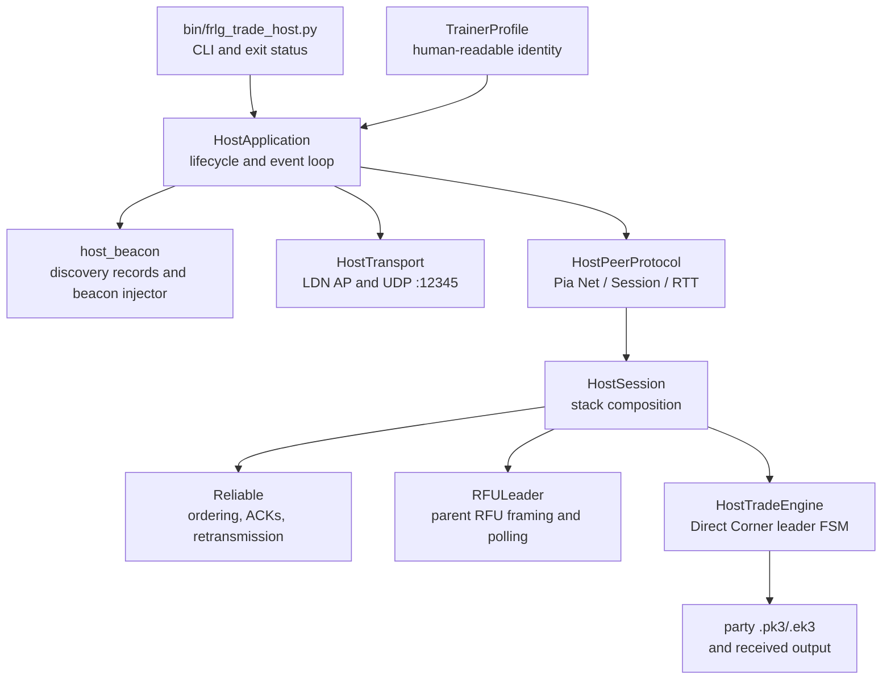
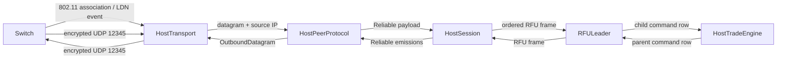
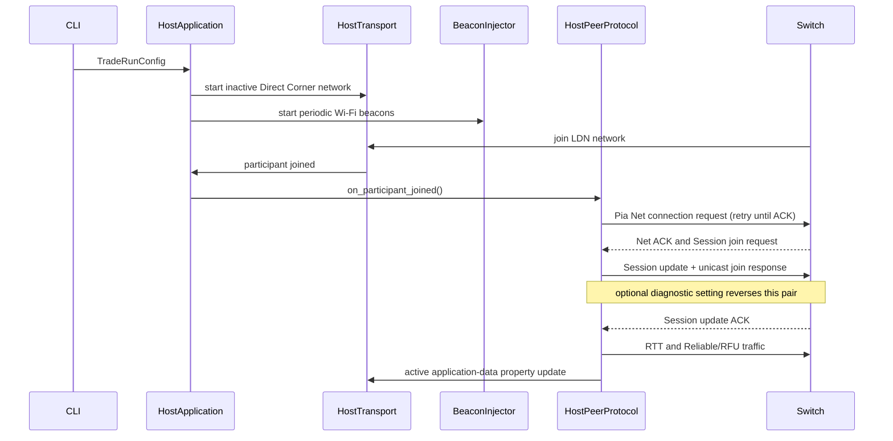
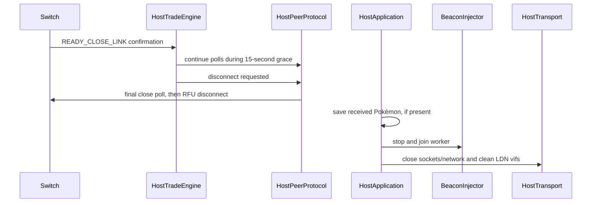
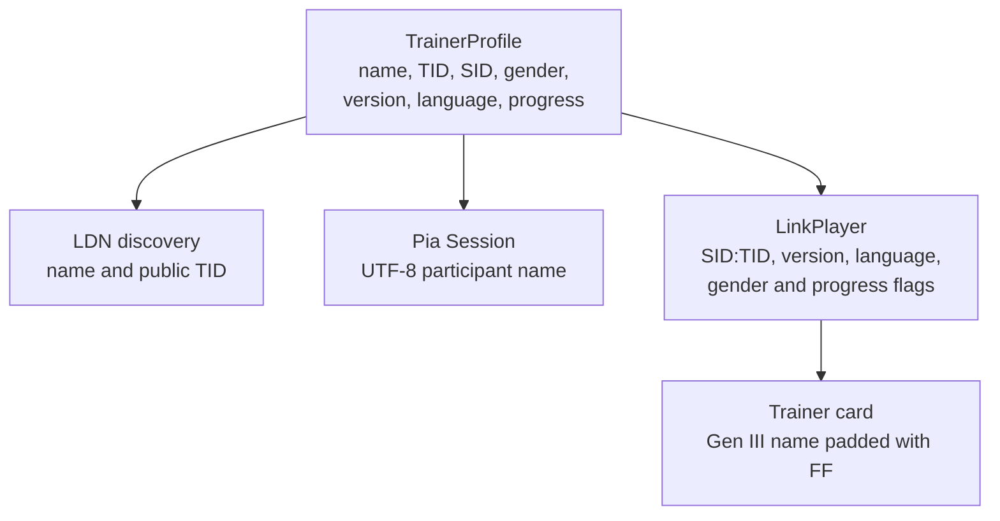

# Host implementation

`bin/frlg_trade_host.py` makes Linux the FireRed/LeafGreen Direct Corner leader. A Switch joins the
Linux LDN network, Pia establishes the peer session, and Reliable carries an emulated parent RFU link
whose game-level endpoint is the leader-side trade state machine. `bin/frlg_mg_host.py` reuses
everything below the activity.

Protocol bytes, message order, retry cadence, VBlank timing and the disconnect grace period live in
the layer that owns them.

## Components and ownership



- `TradeRunConfig` is immutable shared run configuration: `TrainerProfile`, `TradePlan`, `LdnConfig`,
  and role-specific `HostOptions` or `JoinerOptions`.
- `HostApplication` owns resource ordering: input validation, transport startup, beacon injection,
  the event loop, interruption handling and cleanup. Activity hooks supply startup, progress and
  close messages and role-specific persistence; the trade and Mystery Gift hosts share the loop.
- `HostTransport` owns the LDN AP/network, virtual interfaces, participant events and UDP sockets. It
  neither parses Pia nor advances the game state machine.
- `HostPeerProtocol` owns one Switch peer's Pia state: Net negotiation and property updates, Session
  acceptance, RTT, packet ids, native/random nonce selection, encryption and framing, and Reliable
  message batching. It emits transport-independent `OutboundDatagram` values.
- `HostSession` composes Reliable, `RFULeader` and the activity engine. It has no socket or LDN
  dependency; the offline end-to-end tests use this boundary. Its `engine=` keyword selects the
  trade or Mystery Gift activity over the same stack.
- `HostTradeEngine` owns the leader-side room entry, party and card exchange, selection and
  confirmation, animation and save barriers, menu cancellation, room exit, and the close grace period.
  `HostTradeTiming` names the frame counts.
- `BeaconInjector` owns its raw monitor-interface socket and worker thread. `HostApplication` starts
  and stops it with the rest of the runtime resources.

## Data flow



The application loop drains every datagram `HostPeerProtocol` produces and sends it through
`HostTransport`. Timer deadlines come from the peer protocol, so Net/Session retries, RTT probes,
Reliable retransmission and the ~59.727 Hz protocol tick do not depend on a fixed polling delay.

## Startup and session establishment



Malformed Pia, invalid padding, failed authentication, incomplete Reliable tiling and mismatched
Session identities are logged and ignored. A Session request is accepted only when its constant id,
Pia variables, source IP and encrypted header agree with the current LDN peer.

## Trade and room-exit lifecycle

```mermaid
stateDiagram-v2
    [*] --> PlayerExchange
    PlayerExchange --> RoomEntry: LinkPlayer and trainer card
    RoomEntry --> PartyExchange: seat route and entry barriers
    PartyExchange --> Selection: party, mail, ribbons
    Selection --> Confirmation: Switch selects; leader offers configured slot
    Confirmation --> Animation: both confirm
    Animation --> Save: trade committed
    Save --> PartyExchange: another configured trade
    Save --> MenuExit: final party refresh
    MenuExit --> RoomExit: both cancel; five-second field wait
    RoomExit --> CloseGrace: Switch confirms room exit
    CloseGrace --> Disconnect: fifteen seconds of peer traffic
    Disconnect --> [*]
```

Room and menu transitions remain two-sided. After the final trade, the host waits for the Switch trade
menu to become ready; the player selects **CANCEL** and confirms **YES**. The host then finishes the
native standby barriers, waits five seconds before leaving the room, and continues normal peer traffic
for fifteen seconds after the Switch confirms close. Only then is the RFU disconnect queued. An LDN
leave event stops peer output immediately.

## Shutdown and cleanup



The same cleanup runs on normal completion, `KeyboardInterrupt`, startup failure after partial
allocation, and beacon-worker failure. Captures are diagnostic output only and are closed during
cleanup; saving a received Pokemon is independent of capture logging.

## Trainer profile propagation

`pokeldn.config.DEFAULT_TRAINER` supplies the shared default identity. All three CLIs derive an
immutable per-run `TrainerProfile` with `--ot`, `--version` and decimal `--id TID[:SID]` overrides. The
profile validates Gen III names and numeric ranges, then derives every protocol view:



TID and SID are combined as `SID << 16 | TID` for game records. Discovery exposes the public TID; the
Pia participant uses the readable name; LinkPlayer and trainer-card data use the Gen III encoding.
Host LinkPlayer and card names use `0xFF` padding. Joiners retain native `0x00` padding.

## Failure handling

- Host preflight rejects radios without AP support before LDN creation and identifies the selected PHY
  and driver capability.
- The two proven hosting profiles are ALFA AWUS036ACHM / `mt76x0u` with
  `--skip-encryption --no-accept-decrypted-ccmp`, and TP-Link Archer T3U USB `2357:012d` /
  `rtw88_8822bu` with `--skip-encryption --accept-decrypted-ccmp`. Startup identifies either driver
  and warns if the flags do not match its profile.
- Transport startup and beacon-thread failures abort the run and unwind already-created resources.
- Authentication, decryption and malformed-message failures do not enter the RFU/trade stack.
- After LDN authentication succeeds, the AP must mark the station `NL80211_STA_FLAG_AUTHORIZED`.
  The AP starts with userspace control-port handling; without the transition the Realtek station
  disappears about three seconds after joining while monitor-injected traffic still flows.
- `--accept-decrypted-ccmp` is a receive path for monitor drivers that retain CCMP metadata around
  hardware-decrypted plaintext; it removes the retained MIC before TAP delivery. Radiotap-advertised
  trailing FCS bytes are removed for every driver.
- Net and Session establishment retry at their proven cadence until acknowledged; RTT samples feed
  Reliable timing once the Session is finalized.
- An unexpected participant leave halts protocol output. After the normal room-close confirmation
  the host keeps the fifteen-second grace period even if the participant disappears; the Switch may
  still be completing its fade, warp and bridge teardown.
- Output is written only when a complete received Pokemon exists. Input `.pk3` and `.ek3` files are
  never modified.

## Extending the host

Add protocol behaviour at the lowest layer that understands it. Shared settings belong in the run
configuration; OS and network behaviour in the application or transport; Pia messages in
`HostPeerProtocol`; RFU behaviour in `RFULeader`; Direct Corner decisions in `HostTradeEngine`. Test
each boundary on emitted datagrams, Reliable payloads, RFU frames or command rows. Derive identity
representations from `TrainerProfile`.

The implementation supports one joining Switch. More peers need a `HostPeerProtocol` per
participant, independent Pia variables, nonces and packet ids, and a game-level RFU policy; raising
the LDN participant limit alone is insufficient.

## Source map

| source | responsibility |
|---|---|
| `bin/frlg_trade_host.py` | CLI parsing, configuration construction, application entry point |
| `pokeldn/host_cli.py` | shared host identity, LDN, Pia and lifecycle CLI options |
| `pokeldn/frlg/link/host_app.py` | runtime lifecycle, event loop, output and cleanup |
| `pokeldn/config.py` | shared trainer, trade-plan, Mystery Gift payload, LDN, role and run configuration |
| `pokeldn/frlg/link/trade_runtime.py` | shared CLI logging, party loading, slot parsing, output saving |
| `pokeldn/ldn/host_beacon.py` | captured trade beacon, discovery mutation, raw beacon injection |
| `pokeldn/host_support.py` | OS-facing support such as sudo-aware key-path resolution |
| `pokeldn/ldn/transport.py` | LDN host lifecycle, interfaces, participant events, UDP data plane |
| `pokeldn/ldn/host_pia.py` | Pia framing and `HostPeerProtocol` |
| `pokeldn/frlg/link/host_session.py` | Reliable -> RFU leader -> activity composition |
| `pokeldn/ldn/reliable.py` | ordered, retransmitted application channel |
| `pokeldn/gba/rfu_leader.py` | parent RFU framing, NI/UNI handshake, echo table |
| `pokeldn/frlg/link/host_trade.py` | leader trade-room state machine and timing |
| `pokeldn/frlg/link/linkplayer.py` | LinkPlayer and trainer-card encoders |
| `pokeldn/ldn/ldntrace.py` | optional JSONL diagnostics |
